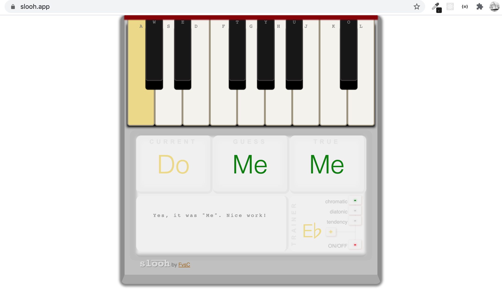
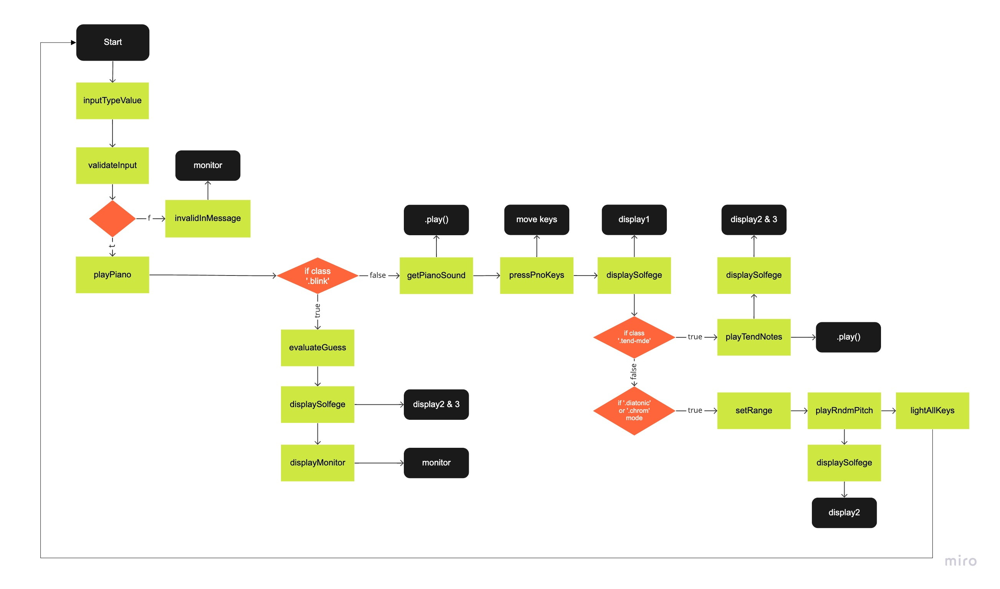

## slo͞oh.app

Music education - [slo͞oh](https://slooh.app)

**slo͞oh** is an interactive ear training tool based on 
               [movable do](https://en.wikipedia.org/wiki/Solf%C3%A8ge#Movable_do_solf%C3%A8ge). 
               Back in the day, before apps (or smart phones for that matter), I used to practice ear training in 
               front of the piano with a pencil in my hand. The idea was to play a reference pitch, close your eyes 
               and press on a random key with the eraser tip. Then, with eyes still closed, I would try to determine 
               the unknown note by establishing its relationship (distance) to the reference pitch. This worked pretty well. 
               Another helpful approach was to practice singing tendency (sometimes referred to as leading) notes. This was 
               also done with the piano. Play the reference and sing the tendency pairs: re-do, fa-mi, la-so ... you get the idea. 
               I decided to make a little app based on this practice and so.. behold, slo͞oh.  I hope you find it helpful. Enjoy!
               

